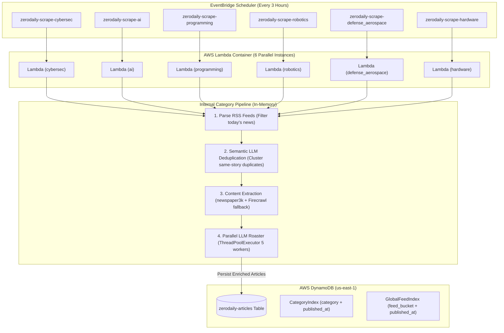

# ZeroDaily News Engine (`bot1`)

[](https://github.com/err0rgod/bot1/actions/workflows/deploy.yml)
[](https://www.python.org/downloads/)
[](https://aws.amazon.com/lambda/)
[](https://aws.amazon.com/dynamodb/)
[](https://aws.amazon.com/bedrock/)

**ZeroDaily** is an automated tech news aggregation, semantic deduplication, and satirical roasting pipeline. It ingests RSS feeds across 6 high-impact technology domains, clusters duplicate breaking news coverage with an LLM, scrapes full article text and hero images, generates both satirical roast summaries and factual breakdowns, and persists enriched stories into Amazon DynamoDB for consumption by web and mobile frontends.

---

## Architecture Overview



---

## News Domains & Categories

| Category Key | Domain | Example Feeds Tracked |
| :--- | :--- | :--- |
| `cybersec` | Cybersecurity & Threat Intel | The Hacker News, BleepingComputer, Krebs on Security, Dark Reading, SecurityWeek |
| `ai` | AI / Machine Learning | VentureBeat, TechCrunch AI, MIT Technology Review, The Verge, MarkTechPost |
| `programming` | Software Engineering & Dev | Dev.to, freeCodeCamp, InfoWorld, SDTimes |
| `robotics` | Robotics & Autonomous Systems | The Robot Report, IEEE Spectrum Robotics, Robohub, Robotics Business Review |
| `defense_aerospace` | Defense, Aerospace & Space | Breaking Defense, Defense News, SpaceNews, Space.com |
| `hardware` | Semiconductors & Hardware | Tom's Hardware, AnandTech, IEEE Spectrum Semiconductors, EEJournal |

---

## Database Schema (DynamoDB)

- **Table Name:** `zerodaily-articles` (Region: `us-east-1`, Billing Mode: `PAY_PER_REQUEST`)
- **Primary Key:** `id` (`String`, URL of the original article)

### Global Secondary Indexes (GSIs)
1. **`CategoryIndex`**:
   - **Partition Key (`HASH`):** `category` (`String`)
   - **Sort Key (`RANGE`):** `published_at` (`String`, ISO-8601 UTC)
   - *Use Case:* Fetching newest articles filtered by category (`get_articles_by_category`).
2. **`GlobalFeedIndex`**:
   - **Partition Key (`HASH`):** `feed_bucket` (`String`, default `"ALL"`)
   - **Sort Key (`RANGE`):** `published_at` (`String`, ISO-8601 UTC)
   - *Use Case:* Fetching the unified chronological global news feed across all categories (`get_latest_feed`).

---

### Telemetry & Execution Metrics Schema (`zerodaily-scrape-metrics`)

- **Table Name:** `zerodaily-scrape-metrics` (Region: `us-east-1`, Billing Mode: `PAY_PER_REQUEST`)
- **Partition Key (`HASH`):** `metric_date` (`String`, e.g. `2026-09-15`)
- **Sort Key (`RANGE`):** `metric_id` (`String`, e.g. `2026-09-15T06:00:00Z#cybersec`)
- **TTL Attribute:** `ttl` (Unix timestamp epoch, auto-expires records after 30 days)
- **Tracked Metrics:** `duration_seconds`, `memory_mb`, `gb_seconds`, `articles_scraped`, `articles_summarized`, `status`.

### Stored Item Attributes
```json
{
  "id": "https://thehackernews.com/2026/09/sample-cve.html",
  "category": "cybersec",
  "published_at": "2026-09-12T14:30:00Z",
  "feed_bucket": "ALL",
  "title": "Critical RCE Vulnerability Discovered in Enterprise Gateway",
  "heading": "Another Day, Another 'Unbreakable' Gateway Breaks",
  "shortSummary": "Engineers promised military-grade encryption, but forgot to secure the front door. Hackers didn't even need a password.",
  "fullSummary": "A critical remote code execution vulnerability (CVE-2026-XXXX) has been discovered affecting over 50,000 edge gateways...",
  "link": "https://thehackernews.com/2026/09/sample-cve.html",
  "image_url": "https://thehackernews.com/images/hero.jpg",
  "created_at": "2026-09-12T14:35:12Z"
}
```

---

## LLM Engine & Deduplication

### 1. Semantic Deduplication ([`llm/deduplicator.py`](file:///D:/bot1/llm/deduplicator.py))
When breaking news happens, 5+ publications report the exact same story. Before downloading heavy HTML, the candidate headlines and snippets are sent to **DeepSeek v3.2** to group duplicate coverage and pick the single best candidate, saving bandwidth and LLM tokens.

### 2. Roasted Summarization ([`llm/Summariser.py`](file:///D:/bot1/llm/Summariser.py))
Articles are summarized concurrently using `ThreadPoolExecutor(max_workers=5)`.
- **Primary Provider:** **AWS Bedrock Converse API** (`deepseek.v3.2` in `us-east-1`). Native IAM authentication with zero external API latency.
- **Fallback Provider:** Direct **DeepSeek OpenAI-compatible API** (`https://api.deepseek.com/v1`).
- **Resilience:** Automatic exponential backoff retry (up to 3 attempts).

---

## Project Structure

```
bot1/
├── .github/
│   └── workflows/
│       └── deploy.yml            # CI/CD pipeline (Test -> Build -> Smoke Test -> Deploy)
├── db/
│   ├── database.py               # DynamoDB access layer (queries, scans, date formatting)
│   └── metrics.py                # Telemetry data layer (GB-seconds, duration, run logs)
├── llm/
│   ├── Summariser.py             # Bedrock / DeepSeek LLM engine with retry logic
│   ├── deduplicator.py           # LLM-based semantic article deduplication
│   └── SummariserDistributer.py  # Thread-pooled multi-article summarizer
├── notifications/
│   ├── __init__.py               # Notifications package entrypoint
│   └── reporter.py               # Morning digest compiler & Resend email dispatcher
├── scraper/
│   ├── Feeds.py                  # RSS feed catalog across 6 categories
│   ├── Scraper.py                # 3-stage scraping engine (RSS -> Dedup -> Extraction)
│   └── ScraperDistributer.py     # Standalone category scraper handler
├── tests/
│   ├── test_database.py          # Unit tests for database module
│   ├── test_deduplicator.py      # Unit tests for semantic deduplication
│   ├── test_lambda_function.py   # Unit tests for unified Lambda driver
│   ├── test_metrics.py           # Unit tests for telemetry and GB-seconds computation
│   ├── test_reporter.py          # Unit tests for Resend morning digest reporter
│   ├── test_scraper.py           # Unit tests for scraper & Firecrawl fallback
│   └── test_summariser.py        # Unit tests for Bedrock/DeepSeek summarization
├── Dockerfile                    # Production AWS Lambda Python 3.12 container
├── .dockerignore                 # Excludes local secrets & cache from Docker context
├── lambdaFunction.py             # Master AWS Lambda driver & orchestrator
├── runner.py                     # Local manual development pipeline runner
├── requirements.txt              # Core runtime & testing dependencies
└── pytest.ini                    # Pytest configuration
```

---

## Local Development & Testing

### 1. Setup Environment
```bash
python -m venv venv
# Windows:
.\venv\Scripts\activate
# Linux/macOS:
source venv/bin/activate

pip install -r requirements.txt
```

### 2. Configure Local `.env`
Copy `.env.example` to `.env` and configure your credentials:
```env
AWS_REGION=us-east-1
DYNAMODB_TABLE_NAME=zerodaily-articles
USE_BEDROCK=true
DEEPSEEK_API_KEY=your_deepseek_key
FIRECRAWL_API_KEY=your_firecrawl_key
```

### 3. Run Test Suite
```bash
pytest -v
```
*All 30 unit tests mock external AWS/API dependencies and run fully offline in ~3 seconds.*

### 4. Run Pipeline Locally
```bash
python runner.py
# Or invoke the driver directly:
python lambdaFunction.py
```

---

## CI/CD Deployment Pipeline

The repository uses GitHub Actions ([`.github/workflows/deploy.yml`](file:///D:/bot1/.github/workflows/deploy.yml)) with a zero-downtime, smoke-tested deployment gate:

1. **Pull Requests & Pushes to `main`:**
   - Automatically runs the 30 unit tests via `pytest`.
2. **Tag Releases (`v*.*.*`):**
   - Runs `pytest` test suite.
   - Builds Linux/amd64 Docker image with `--provenance=false`.
   - Pushes image to Amazon ECR (`zerodaily-scraper-pipeline`) tagged with version and `latest`.
   - **Smoke Test:** Deploys image to `zerodaily-scraper-pipeline-test` and invokes a test payload.
   - **Promotion:** Only if the smoke test passes cleanly, promotes the image to production (`zerodaily-scraper-pipeline`).

### Triggering a Release:
```bash
git tag v0.1.1
git push origin v0.1.1
```
