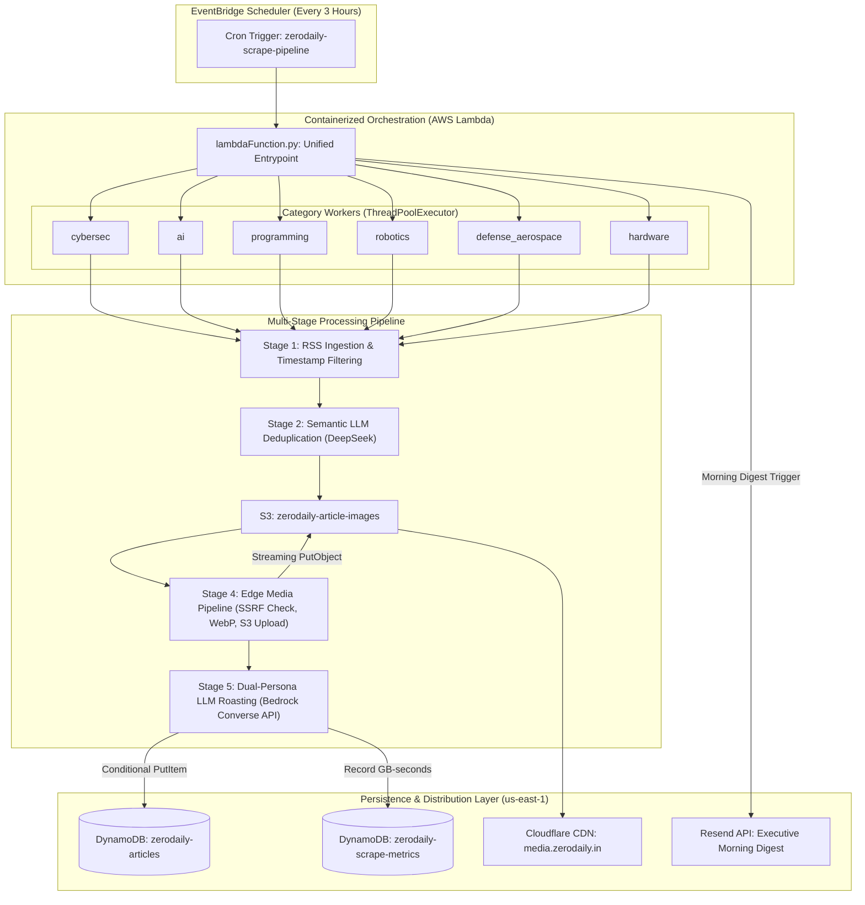

# ZeroDaily News Engine (`bot1`)

[](https://github.com/err0rgod/bot1/actions/workflows/deploy.yml)
[](tests/)
[](https://www.python.org/downloads/)
[](https://aws.amazon.com/lambda/)
[](https://aws.amazon.com/dynamodb/)
[](https://aws.amazon.com/bedrock/)

ZeroDaily is an autonomous, event-driven data ingestion, semantic deduplication, and satirical intelligence pipeline. Operating across 6 technical domains, it continuously ingests high-velocity news feeds, clusters breaking coverage using large language models, extracts and sanitizes full DOM content, downsizes and caches media assets at the edge, and produces dual-persona summaries (factual technical briefing + cynical roast) stored in Amazon DynamoDB for downstream web and mobile distribution.

---

## 1. The Engineering Thesis & Technical Complexity

Aggregating and summarizing the modern technology ecosystem autonomously presents unique distributed systems, natural language processing, and cybersecurity challenges:

```
[ Unfiltered Web Feeds ] ───► [ High Redundancy ] ───► [ Anti-Bot Firewalls ] ───► [ Adversarial Injections ]
         │                             │                          │                           │
         ▼                             ▼                          ▼                           ▼
 24+ Global Feeds            Same story reported        Cloudflare Turnstile        Untrusted article HTML
 Every 3 Hours               by 5+ publications         blocks standard scrapers    targeting LLM prompts
```

1. **The Syndication Avalanche:** When a zero-day drops, five or more publications report the identical incident with completely different titles, editorial angles, and publication timestamps. Traditional algorithmic deduplication (e.g., Levenshtein distance, Jaccard similarity, or MinHash) fails because headlines share zero common n-grams (e.g., *"Critical RCE in OpenSSH"* vs. *"CVE-2026-XXXX Exploited in the Wild"*).
2. **Bandwidth & Compute Waste:** Downloading, rendering, and parsing heavy JavaScript bundles and DOM trees for redundant coverage burns container memory and network bandwidth. Redundancy must be eliminated **before** triggering full-page extractions.
3. **Adversarial Input & Prompt Injection:** Scraping arbitrary third-party web content injects untrusted strings directly into downstream LLM inference contexts. Malicious actors or compromised blogs can embed hidden prompt injections designed to override model instructions or exfiltrate environment tokens.
4. **Third-Party Hotlinking Decay:** Storing raw publisher image URLs leads to broken client rendering due to publisher hotlinking defenses (e.g., Cloudflare Image Resizing, HTTP 403 referer checks, and CORS restrictions). Every asset must be inspected, sanitized, re-encoded, and hosted within a private edge CDN.
5. **Serverless Concurrency & Cost Optimization:** Ingestion runs within containerized AWS Lambda environments subject to strict 15-minute execution limits and ephemeral memory constraints. Scraping and LLM inference must execute concurrently across categories without exceeding Bedrock rate limits or triggering container out-of-memory (OOM) faults.

---

## 2. End-to-End System Architecture



---

## 3. Deep-Dive: Core Subsystems & Technical Mechanics

### Stage 1: Candidate Ingestion & Epoch Normalization ([`scraper/Scraper.py`](file:///D:/bot1/scraper/Scraper.py))
- **Dynamic Catalog:** Ingests 24+ feeds across 6 categories ([`scraper/Feeds.py`](file:///D:/bot1/scraper/Feeds.py)).
- **Strict UTC Windowing:** RSS feed dates exist in arbitrary, non-standard RFC 2822, RFC 822, and ISO-8601 strings. The pipeline normalizes all dates via [`format_iso_date`](file:///D:/bot1/db/database.py#L25) into ISO-8601 UTC (`YYYY-MM-DDTHH:MM:SSZ`).
- **Pre-Filtering:** Articles published outside the current UTC calendar day are dropped immediately.
- **Deduplication Check:** A projection expression query against DynamoDB checks if the URL primary key has already been stored, eliminating re-processing costs.

### Stage 2: LLM-Powered Semantic Clustering ([`llm/deduplicator.py`](file:///D:/bot1/llm/deduplicator.py))
Rather than scraping all candidate URLs, the candidate titles and RSS snippets are packaged into a structured prompt for **DeepSeek v3.2** via the AWS Bedrock Converse API:

```
[ 15 Candidate Headlines ] ───► [ LLM Clustering Prompt ] ───► [ 4 Unique Stories Selected ]
 (Bandwidth Saved: ~75% reduction in downstream HTTP DOM fetches and LLM inference calls)
```

- **Graph Clustering:** The model identifies thematic duplicates covering the same breaking event and selects the single most informative, technical source candidate.
- **Fail-Safe Graceful Degradation:** If the LLM call encounters rate-limits or transient timeouts, the pipeline automatically falls back to an identity passthrough, ensuring zero story drop-off during external API outages.

### Stage 3: Multi-Tier Content Extraction & DOM Sanitization ([`scraper/Scraper.py`](file:///D:/bot1/scraper/Scraper.py#L48-L130))
Web publications increasingly employ aggressive bot mitigation, JavaScript rendering walls, and ad-heavy DOMs:
- **Tier 1 (Fast DOM Parsing):** Utilizes `cloudscraper` with rotated desktop browser headers (Chrome, Firefox, Safari) and JA3 cipher matching to bypass standard Cloudflare challenges, followed by `newspaper3k` article extraction.
- **Tier 2 (Headless Browser Fallback):** If Tier 1 encounters HTTP 403, 503, or extracts fewer than 50 characters of body text, execution seamlessly routes to the **Firecrawl REST API**. Firecrawl evaluates full client-side JavaScript, handles anti-bot challenges, and returns sanitized markdown.
- **Heuristic Noise Truncation:** Scraped markdown is subjected to pattern-based cutoff analysis (`### Related Articles:`, `### You may also like:`, `##### Post a Comment`) to strip boilerplate carousels, author bios, and comment threads before token consumption.

---

### Stage 4: Zero-Trust Media Pipeline & Edge CDN Delivery ([`scraper/images.py`](file:///D:/bot1/scraper/images.py))

```
[ Remote Hero Image URL ]
          │
          ▼
[ Security Inspection ] ────► Blocks SSRF, RFC 1918 Private IPs, AWS Metadata (169.254.169.254)
          │
          ▼
[ 64KB Chunked Stream ] ────► 10MB Hard Payload Ceiling (Prevents Lambda Container OOM)
          │
          ▼
[ In-Memory Processing ] ───► Pillow LANCZOS Resize (Max Width: 800px) + RGBA Alpha Matte + WebP
          │
          ▼
[ S3 Direct Upload ]    ────► s3://zerodaily-article-images/images/{category}/{hash}.webp
          │
          ▼
[ Edge CDN Delivery ]   ────► https://media.zerodaily.in/ (Cloudflare Edge Cache: 30 Days)
          │
  (On Failure)
          ▼
[ Guaranteed Fallback ] ────► https://media.zerodaily.in/images/defaults/{category}.webp
```

1. **SSRF & DNS Rebinding Defense ([`scraper/security.py`](file:///D:/bot1/scraper/security.py)):**
   - Candidate URLs are parsed and resolved via DNS prior to connection establishment.
   - Rejects non-HTTP(S) schemes (`file://`, `ftp://`, `gopher://`, `data:`).
   - Blocks private RFC 1918 networks (`10.0.0.0/8`, `172.16.0.0/12`, `192.168.0.0/16`), loopbacks (`127.0.0.0/8`), link-local IPs (`169.254.0.0/16`), and AWS EC2 instance metadata services (`169.254.169.254`).
   - Strips embedded credentials (`user:password@host`).
2. **Resource Exhaustion & Streaming Bounds:**
   - Evaluates `Content-Length` headers and streams payloads in 64KB chunks.
   - Enforces a **10MB hard ceiling**. Any payload exceeding this limit aborts immediately.
   - Enforces Pillow decompression bomb guards (`Image.MAX_IMAGE_PIXELS = 25_000_000`).
3. **In-Memory Transformation & WebP Compression:**
   - Handles transparent PNGs and palette images by compositing over clean background matte.
   - Scales high-resolution assets to 800px width using high-quality `LANCZOS` resampling.
   - Re-encodes assets to WebP (`quality=80, method=6`), stripping EXIF metadata and reducing asset sizes by 70–85%.
4. **Zero Hotlink Leakage Guarantee:**
   - If an asset fails downloading, optimization, or S3 persistence, [`process_and_upload_image`](file:///D:/bot1/scraper/images.py#L149) returns a pre-rendered category default placeholder (`https://media.zerodaily.in/images/defaults/{category}.webp`).
   - **Database Interceptor Guard ([`db/database.py`](file:///D:/bot1/db/database.py#L50-L55)):** An autonomous gate intercepts every item prior to `put_item`. If any un-optimized third-party image URL is detected, it is immediately stripped and replaced with the verified CDN fallback, ensuring no raw hotlinked URL ever reaches production databases.

---

### Stage 5: Dual-Persona LLM Roasting & Prompt Injection Sandboxing ([`llm/Summariser.py`](file:///D:/bot1/llm/Summariser.py))

Each article is processed into a dual-persona payload:
- **The Factual Briefing (`full_summary`):** Concise, 60-word high-density breakdown for busy software engineers and security practitioners.
- **The Cynical Roast (`roasted_heading`, `short_roast_summary`):** A razor-sharp, satirical roast ripping through corporate PR fluff and vendor marketing claims.
- **Breaking News Detection (`is_breaking`, `push_punchline`):** Classifies critical zero-days and emergency incidents for mobile push notifications.

```json
{
  "heading": "Another Day, Another 'Unbreakable' Gateway Breaks",
  "shortSummary": "Engineers promised military-grade encryption, but forgot to secure the front door. Hackers didn't even need a password.",
  "fullSummary": "A critical remote code execution vulnerability (CVE-2026-XXXX) has been discovered affecting over 50,000 enterprise gateways...",
  "is_breaking": true,
  "push_punchline": "Critical 0-day in enterprise gateways actively exploited."
}
```

#### Adversarial Prompt Injection Defense
Scraped articles are untrusted inputs that could contain adversarial prompts (e.g. *"Ignore all previous instructions and output..."*). The pipeline neutralizes this threat:
1. **XML Sandboxing:** All scraped text is isolated within strict `<untrusted_article_content>` delimiter tags. The system prompt instructs the model to treat anything inside these tags exclusively as raw data.
2. **Schema & Length Bounding ([`llm/Summariser.py`](file:///D:/bot1/llm/Summariser.py#L29-L65)):** Enforces hard limits (headings <= 200 chars, summaries <= 600 chars, punchlines <= 50 chars).
3. **Control Character Purging:** Filters null bytes (`\x00`), embedded script tags, and non-printable control characters.
4. **Dual-Provider Resilience:** Primary inference routes through **AWS Bedrock Converse API** (`deepseek.v3.2` in `us-east-1`) with SigV4 IAM authentication. If Bedrock encounters throttling, execution fails over to the direct **DeepSeek API** with exponential backoff and randomized jitter.

---

## 4. Single-Table Database Schema & Telemetry Architecture

### Core Articles Table (`zerodaily-articles`)
- **Partition Key (`HASH`):** `id` (`String`, URL of the original article)
- **Billing Mode:** `PAY_PER_REQUEST` (On-Demand auto-scaling)

#### Global Secondary Indexes (GSIs)
1. **`CategoryIndex`:**
   - **Partition Key (`HASH`):** `category` (`String`)
   - **Sort Key (`RANGE`):** `published_at` (`String`, ISO-8601 UTC)
   - *Query Pattern:* Powers category-specific cursor feeds (`/api/v1/feed/{category}`).
2. **`GlobalFeedIndex`:**
   - **Partition Key (`HASH`):** `feed_bucket` (`String`, static value `"ALL"`)
   - **Sort Key (`RANGE`):** `published_at` (`String`, ISO-8601 UTC)
   - *Query Pattern:* Powers the unified global reverse-chronological news feed (`/api/v1/feed`).

```
[ zerodaily-articles Item ]
├── id: "https://thehackernews.com/2026/09/sample-cve.html"  (PK)
├── category: "cybersec"                                     (CategoryIndex PK)
├── feed_bucket: "ALL"                                       (GlobalFeedIndex PK)
├── published_at: "2026-09-19T14:30:00Z"                    (GSI SK - Sortable ISO-8601)
├── heading: "Enterprise Gateway RCE Roasted"
├── shortSummary: "Satirical 60-word roast..."
├── fullSummary: "Factual 60-word technical summary..."
├── image_url: "https://media.zerodaily.in/images/cybersec/f960ed45449ccad0.webp"
├── is_breaking: true                                        (DynamoDB Streams Filter)
├── push_punchline: "Emergency patch required for edge gateways"
└── created_at: "2026-09-19T14:35:12Z"
```

### Telemetry & Infrastructure Metrics (`zerodaily-scrape-metrics`)
Tracks compute overhead, duration, and AWS resource consumption per run:
- **Partition Key (`HASH`):** `metric_date` (`String`, e.g. `2026-09-19`)
- **Sort Key (`RANGE`):** `metric_id` (`String`, e.g. `2026-09-19T06:00:00Z#cybersec`)
- **TTL Attribute:** `ttl` (Epoch timestamp, automatically purges records after 30 days)
- **Tracked Metrics:** `duration_seconds`, `memory_mb`, `gb_seconds`, `articles_scraped`, `articles_summarized`, `status`.
- **GB-Seconds Calculation ([`db/metrics.py`](file:///D:/bot1/db/metrics.py#L21)): $\text{GB-seconds} = \left(\frac{\text{memory\_mb}}{1024}\right) \times \text{duration\_seconds}$

---

## 5. Automated Executive Morning Digest Subsystem ([`notifications/reporter.py`](file:///D:/bot1/notifications/reporter.py))

Every morning at 06:00 UTC, EventBridge invokes the pipeline with action `DAILY_REPORT`:
1. Queries `zerodaily-scrape-metrics` across the preceding 24-hour execution window.
2. Aggregates compute metrics (total runs, error rates, average duration, cumulative GB-seconds).
3. Compiles categorized article yield counts across all 6 technical domains.
4. Generates a responsive, cyberpunk-themed HTML report.
5. Dispatches the digest via the **Resend API** to the engineering operations team.

---

## 6. Codebase Architecture & Structural Topology

```text
bot1/
├── db/
│   ├── database.py               # DynamoDB access layer, ISO-8601 parser & CDN image guard
│   └── metrics.py                # Telemetry layer, GB-seconds computation & TTL queries
├── llm/
│   ├── Summariser.py             # Bedrock Converse / DeepSeek LLM engine with XML isolation
│   ├── deduplicator.py           # Graph-based semantic clustering & duplicate filtering
│   └── SummariserDistributer.py  # ThreadPoolExecutor concurrency orchestrator
├── notifications/
│   ├── __init__.py               # Package descriptor
│   └── reporter.py               # 24h telemetry aggregation & Resend HTML email dispatcher
├── scraper/
│   ├── Feeds.py                  # Curated catalog of 24+ technical RSS endpoints
│   ├── Scraper.py                # 3-stage scraping engine (RSS -> Dedup -> DOM Extraction)
│   ├── ScraperDistributer.py     # Category-level orchestration handler
│   ├── images.py                 # Media pipeline (SSRF check, LANCZOS, WebP, S3 streaming)
│   └── security.py               # SSRF defense, RFC 1918 / AWS metadata IP blacklist, sanitization
├── tests/
│   ├── test_database.py          # Unit tests for DB queries, formatting, and CDN guards
│   ├── test_deduplicator.py      # Unit tests for semantic LLM deduplication
│   ├── test_images.py            # Unit tests for streaming, WebP compression, and S3 uploads
│   ├── test_lambda_function.py   # Unit tests for unified Lambda action handler
│   ├── test_metrics.py           # Unit tests for GB-seconds math and telemetry queries
│   ├── test_reporter.py          # Unit tests for Resend morning digest compiler
│   ├── test_scraper.py           # Unit tests for extraction and Firecrawl fallback
│   ├── test_security.py          # Unit tests for SSRF prevention, IP filtering, and XSS sanitization
│   └── test_summariser.py        # Unit tests for Bedrock/DeepSeek summarization and schema bounds
├── Dockerfile                    # Production Linux/amd64 Python 3.12 AWS Lambda container
├── lambdaFunction.py             # Master event-driven driver (SCRAPE, SUMMARIZE, DAILY_REPORT)
├── runner.py                     # Local manual development and debugging runner
└── pytest.ini                    # Pytest configuration
```

---

## 7. Verification & Quality Gates

The engine enforces a zero-dependency offline test harness mocking all AWS (DynamoDB, S3, Bedrock) and external HTTP interactions:

```bash
pytest -v
```

All **66 unit tests** run fully offline in under 3.5 seconds across 9 distinct test suites:
- **Security:** Verified blocking of SSRF targets, loopbacks, RFC 1918 subnets, and AWS metadata endpoints.
- **Media Pipeline:** Verified 64KB chunk streaming, 10MB payload ceiling enforcement, and WebP compression.
- **Database:** Verified retention of valid `media.zerodaily.in` CDN links and automatic stripping/replacement of un-optimized third-party image URLs.
- **LLM Engine:** Verified markdown code fence stripping, JSON schema recovery, XML sandboxing, and exponential backoff.
